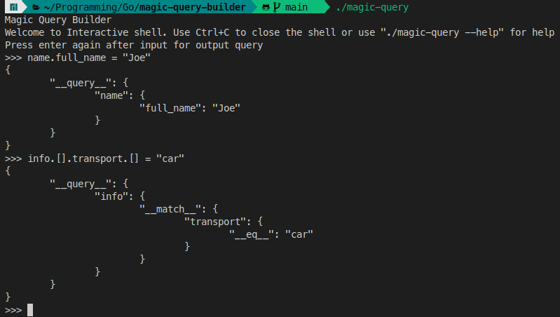
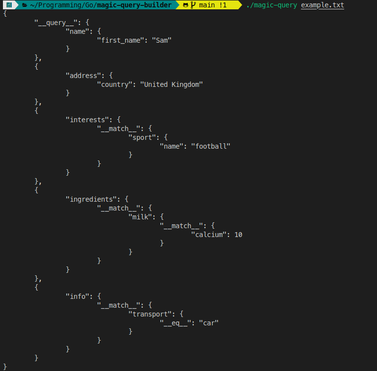
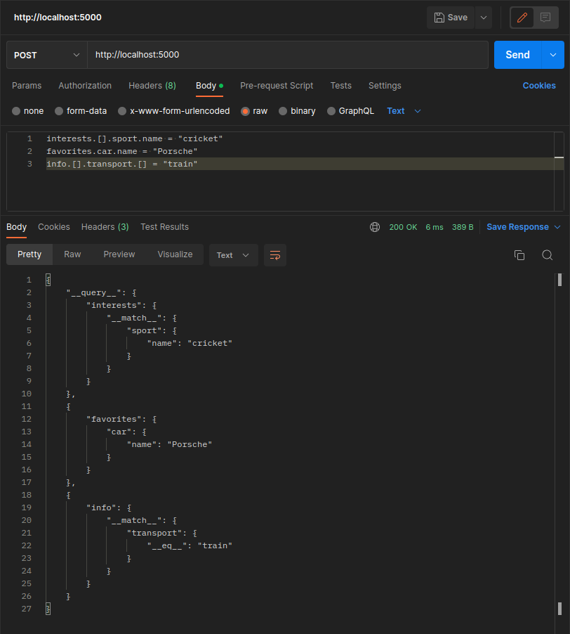

# Magic Query Builder

This is a command-line interface (CLI) application written in [Go](https://go.dev) that can be used to generate queries.

## Steps to run the app

### 1. Building the CLI 🛠️

```bash
# Clone the repository
git clone https://github.com/ByteCrak07/magic-query-builder.git

# Change into the project directory
cd magic-query-builder

# Build the executable (optional)
go build .
```

### 2. Running the CLI 💻

To run the CLI, open a terminal and navigate to the project directory.

```bash
# To launch the interactive shell
./magic-query

# To read queries from a file (refer example.txt)
./magic-query <file>

# To start the HTTP server (send POST req to generate query)
./magic-query --serve

# To see the usage instructions, use the --help flag
./magic-query --help
```

To run the CLI without building the executable use:

```bash
# Interactive shell
go run .

# Read file
go run . <file>

# HTTP server
go run . --serve

# Help
go run . --help
```

## Screenshots

### 1. Interactive shell



### 2. Reading from file



### 3. POST request via server



## Made with [](https://go.dev)
